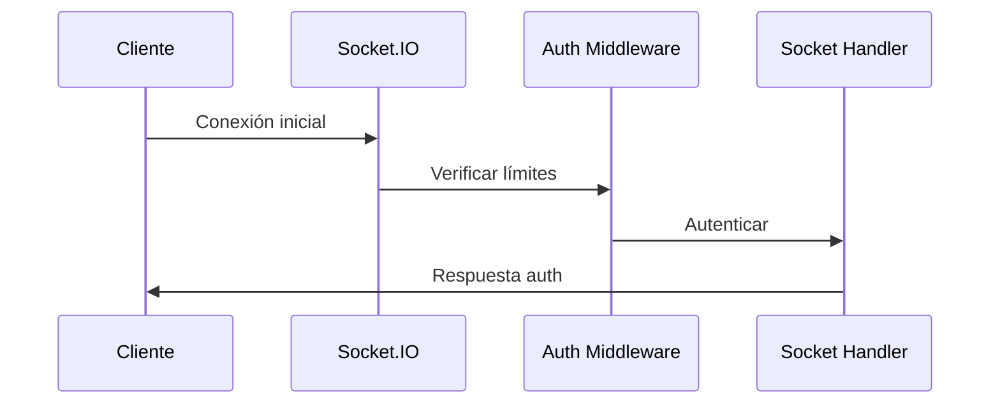
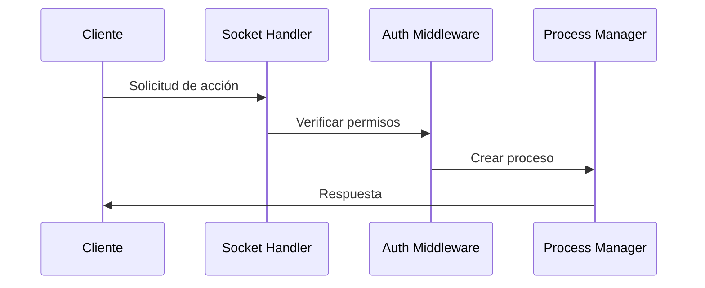

# Arquitectura del Sistema de Simulación IPC

## Estructura General del Proyecto

```
src/
├── index.js                # Punto de entrada principal
├── routes/                 # Rutas HTTP
│   └── index.js           # Definición de endpoints REST
├── sockets/               # Manejo de WebSockets
│   └── connectionHandler.js # Gestión de conexiones Socket.IO
├── middleware/            # Middlewares
│   └── auth.js           # Autenticación y control de acceso
├── utils/                 # Utilidades
│   └── systemHealth.js    # Monitoreo de salud del sistema
├── core/                  # Núcleo del sistema
│   ├── logger/           # Sistema de logging
│   ├── metrics/          # Recolección de métricas
│   ├── process/          # Gestión de procesos
│   └── queue/            # Sistema de colas
└── config/               # Configuraciones
    └── config.js         # Configuración centralizada
```

## Componentes Principales

### 1. Servidor Principal (src/index.js)

- **Función**: Punto de entrada de la aplicación
- **Responsabilidades**:
  - Inicialización de Express y Socket.IO
  - Configuración de métricas Prometheus
  - Registro de middlewares globales
  - Inicialización de gestores (ProcessManager, MetricsCollector)
- **Dependencias**:
  - Express
  - Socket.IO
  - Prometheus
  - Componentes core del sistema

### 2. Rutas HTTP (src/routes/index.js)

- **Endpoints**:
  - `GET /` - Página de bienvenida
  - `GET /metrics` - Métricas Prometheus
  - `GET /status` - Estado general del sistema
  - `GET /health` - Estado de salud del sistema
  - `GET /status/detailed` - Estado detallado del sistema
- **Funcionalidades**:
  - Monitoreo de procesos activos
  - Estadísticas por tipo de proceso
  - Información de conexiones
  - Métricas detalladas del sistema

### 3. Gestión de Sockets (src/sockets/connectionHandler.js)

- **Eventos Socket.IO**:
  - `auth` - Autenticación de clientes
  - `accion` - Ejecución de acciones
  - `interrumpir` - Interrupción de procesos
  - `disconnect` - Desconexión de clientes
- **Validaciones**:
  - Autenticación de usuarios
  - Control de rate limiting
  - Verificación de permisos
  - Gestión de errores

### 4. Middleware de Autenticación (src/middleware/auth.js)

- **Funciones**:
  - `checkRateLimit` - Control de límite de peticiones
  - `tienePermiso` - Verificación de permisos
  - `checkConnectionLimit` - Control de límite de conexiones
- **Características**:
  - Rate limiting por socket
  - Sistema de permisos basado en roles
  - Control de conexiones concurrentes

### 5. Monitoreo de Salud (src/utils/systemHealth.js)

- **Métricas Monitoreadas**:
  - Uso de memoria
  - Conexiones activas
  - Procesos activos
- **Alertas**:
  - Uso excesivo de memoria
  - Alto número de conexiones
  - Sobrecarga de procesos

## Flujos de Datos

### 1. Flujo de Autenticación



### 2. Flujo de Ejecución de Acciones



## Métricas y Monitoreo

### Métricas Prometheus

- `ipc_active_processes`: Procesos activos
- `ipc_errors_total`: Total de errores
- `ipc_queue_size`: Tamaño de la cola

### Endpoints de Monitoreo

- `/metrics`: Métricas en formato Prometheus
- `/health`: Estado de salud del sistema
- `/status`: Estado general
- `/status/detailed`: Estado detallado

## Configuración del Sistema

### Variables de Entorno

- `PORT`: Puerto del servidor (default: 3000)
- `NODE_ENV`: Entorno de ejecución
- `LOG_LEVEL`: Nivel de logging

### Límites del Sistema

- Rate limiting por cliente
- Máximo de conexiones concurrentes
- Límite de procesos por cliente
- Umbrales de alertas de salud

## Seguridad

### Control de Acceso

- Autenticación basada en roles
- Rate limiting por cliente
- Validación de permisos por acción

### Validaciones

- Verificación de credenciales
- Control de límites de recursos
- Sanitización de datos de entrada

## Manejo de Errores

### Tipos de Errores

- Errores de autenticación
- Errores de permisos
- Errores de límites
- Errores de proceso

### Logging

- Logging centralizado
- Niveles de log configurables
- Registro de eventos críticos
